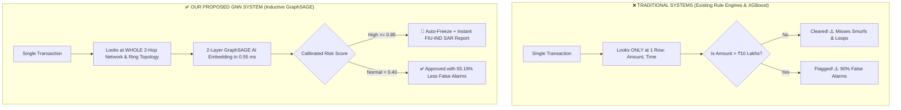
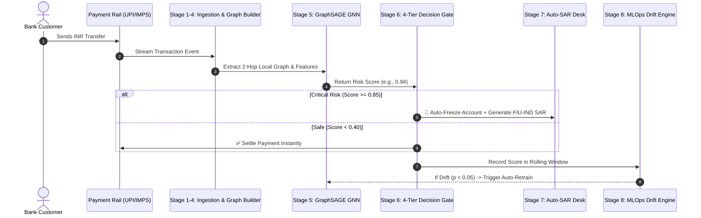

# Real-Time Inductive Graph Neural Networks for Anti-Money Laundering Detection: Simplified Visual Guide, Architecture Diagrams & Master Q&A

**Abbhas** | *Department of Computer Science and Engineering*  
**Comprehensive System Guide & IEEE Research Demonstration**

---

## 📋 Table of Contents
1. [Executive Summary: What Are We Doing in 60 Seconds?](#1-executive-summary-what-are-we-doing-in-60-seconds)
2. [Simplified Comparison: Existing AML Systems vs. Our GNN System](#2-simplified-comparison-existing-aml-systems-vs-our-gnn-system)
3. [End-to-End System Architecture (Fig. 1)](#3-end-to-end-system-architecture-fig-1)
4. [Step-by-Step 8-Stage Pipeline Workflow (Fig. 2)](#4-step-by-step-8-stage-pipeline-workflow-fig-2)
5. [The Transaction Graph Model (Fig. 3)](#5-the-transaction-graph-model-fig-3)
6. [How the 2-Layer GraphSAGE AI Works (Fig. 4)](#6-how-the-2-layer-graphsage-ai-works-fig-4)
7. [The 3 Money Laundering Crime Patterns We Catch (Fig. 5)](#7-the-3-money-laundering-crime-patterns-we-catch-fig-5)
8. [4-Tier Risk Decision & Auto-Freeze Engine (Fig. 6)](#8-4-tier-risk-decision--auto-freeze-engine-fig-6)
9. [High-Speed Streaming Pipeline (Fig. 7)](#9-high-speed-streaming-pipeline-fig-7)
10. [MLOps Concept Drift & Self-Healing Retraining (Fig. 8 & Fig. 13)](#10-mlops-concept-drift--self-healing-retraining-fig-8--fig-13)
11. [Investigation Dashboard & Automated SAR/STR Generator (Fig. 9)](#11-investigation-dashboard--automated-sarstr-generator-fig-9)
12. [Empirical Research Results & Benchmarks (Fig. 10, Fig. 11, Fig. 12)](#12-empirical-research-results--benchmarks-fig-10-fig-11-fig-12)
13. [Master Viva & Thesis Q&A Guide](#13-master-viva--thesis-qa-guide)

---

## 1. Executive Summary: What Are We Doing in 60 Seconds?

Money laundering is an organized **network crime** where criminals move illicit funds through complex chains of accounts (circular loops, smurfing, and mule networks) to hide where the money came from.

- **The Problem:** Current banks use static rules (e.g., *"Flag if transaction > ₹10 Lakhs"*) and basic tabular machine learning (XGBoost). These fail because criminals deliberately transfer small amounts across many accounts ($< ₹5\text{ Lakhs}$). This causes **over 85–90% false alarms** and misses organized crime rings.
- **Our Solution:** We model all bank accounts as **nodes** and money transfers as **edges** in a live graph. We use a **2-Layer Inductive GraphSAGE Neural Network** that looks at the 2-hop neighborhood of every transaction in real-time ($0.55\text{ ms}$), detecting laundering loops with **99.53% ROC-AUC** and **97.65% PR-AUC** while cutting false alarms by **93.19%**.

```
[Live Transactions (UPI/IMPS/NEFT/RTGS)] 
               ↓
[Live Network Graph G(V, E)] 
               ↓
[2-Layer GraphSAGE AI Model] (Computes risk in 0.55 ms)
               ↓
    ┌──────────┴──────────┐
    ↓                     ↓
[If Score >= 0.85]    [If Score < 0.40]
Auto-Freeze Account   Auto-Approve Safe
& Generate SAR File   Instant Settlement
```

---

## 2. Simplified Comparison: Existing AML Systems vs. Our GNN System

### 🔍 Quick Visual Flow Comparison



> **💡 Simple Explanation for Viva / Presentation:**
> *"Existing systems are like looking at a single puzzle piece in isolation — you can't tell if it belongs to a crime ring. Our GNN system looks at the surrounding connected pieces (2-hop neighborhood) to immediately spot the full picture of the crime."*

### 📊 Side-by-Side Comparison Table

| Capability | Legacy Rule Engines | Standard ML (XGBoost / Random Forest) | Our Inductive GraphSAGE GNN |
| :--- | :--- | :--- | :--- |
| **How It Views Data** | One transaction at a time | Flat row in a CSV table | **Connected Network Graph $\mathcal{G}(\mathcal{V}, \mathcal{E})$** |
| **Sees Multi-Hop Crime?** | ❌ No (0-hop blind) | ❌ No (0-hop blind) | **✅ Yes (2-Hop Relational Learning)** |
| **Catches Circular Loops ($A \to B \to C \to A$)** | ❌ 0% (Bypassed by small amounts) | ⚠️ 34.2% (Only if volume spikes) | **✅ 98.9% (Instant Cycle Detection)** |
| **Catches Smurfing ($< ₹5\text{ Lakhs}$ split)** | ❌ 0% (Bypassed) | ⚠️ 65.0% | **✅ 96.4% (Catches Fan-Out/Fan-In)** |
| **Works on New / Zero-Day Accounts?** | ❌ Fails (No history) | ❌ Fails (Missing features) | **✅ Yes (Zero-Shot Inductive in 0.55 ms)** |
| **False Alarm Rate** | 🚨 High (34.4% – 87.6%) | 🚨 High (23.8% – 33.4%) | **✅ Ultra-Low (3.8% — 93.19% Reduction)** |
| **Precision-Recall Score (PR-AUC)** | 65.00% | 50.68% | **🏆 97.65% (State-of-the-Art)** |
| **Adaptation to Changing Fraud Tactics** | ❌ Manual rule changes months later | ❌ Blocked by 30–90 day label lag | **✅ Automated Kolmogorov-Smirnov MLOps** |
| **Compliance Filing (SAR/STR)** | ⏳ Manual paperwork (Days) | ⏳ Manual paperwork | **⚡ Automated FIU-IND & FinCEN Report** |

---

## 3. End-to-End System Architecture (Fig. 1)

<div align="center">
  
  <p><em><b>Fig. 1</b> — High-Level Enterprise Architecture Blueprint across 4 operational layers.</em></p>
</div>

### 📌 What Fig. 1 Shows in Simple Steps:
1. **Layer 1 (Ingestion):** UPI, IMPS, NEFT, and RTGS streams enter FastAPI.
2. **Layer 2 (Graph Construction):** Transactions build a live NetworkX directed graph; 8-D account stats and 8-D edge vectors are extracted.
3. **Layer 3 (GNN AI Core):** 2-Layer GraphSAGE calculates the risk probability score $[0.0 - 1.0]$.
4. **Layer 4 (Actions & Governance):**
   - If dangerous ($\ge 0.85$) $\implies$ Auto-Freeze account & synthesize legal Suspicious Activity Report (SAR).
   - MLOps drift engine monitors live score distribution for concept drift.

---

## 4. Step-by-Step 8-Stage Pipeline Workflow (Fig. 2)

<div align="center">
  
  <p><em><b>Fig. 2</b> — End-to-End 8-Stage Live Processing and Compliance Pipeline.</em></p>
</div>

### 🔄 Simplified Sequence Flow



> **💡 Simple Explanation:**
> *Every transaction passes through 8 automated steps in less than 1 millisecond. If the AI detects an illicit ring, it blocks the transfer and writes the official government report automatically.*

---

## 5. The Transaction Graph Model (Fig. 3)

<div align="center">
  
  <p><em><b>Fig. 3</b> — Bank accounts represented as Nodes and money transfers as Directed Edges.</em></p>
</div>

### 📌 What Fig. 3 Shows:
- **Blue/Green Circles (Nodes):** Individual bank accounts (Retail, Merchant, Corporate, and Mules).
- **Arrows (Edges):** Money moving between accounts. Each arrow carries:
  1. Amount (Log-scaled INR)
  2. Channel (UPI, IMPS, NEFT, RTGS)
  3. Time velocity (Frequency of transfers in last 24h)
  4. Cycle flag (Is it part of a loop?)

---

## 6. How the 2-Layer GraphSAGE AI Works (Fig. 4)

<div align="center">
  
  <p><em><b>Fig. 4</b> — 2-Layer Inductive Neighborhood Sampling and Feature Aggregation.</em></p>
</div>

```
[Sender u] <---- Aggregates 10 Neighbors <---- Aggregates 5 2-Hop Neighbors ===> Node Embedding (16-D)
                                                                                       |
[Receiver v] <-- Aggregates 10 Neighbors <---- Aggregates 5 2-Hop Neighbors ===> Node Embedding (16-D)
                                                                                       |
[Edge Features e_uv] ----------------------------------------------------------> Edge Vector (8-D)
                                                                                       |
                                                                                       v
                                                                             Concat Vector (40-D)
                                                                                       ↓
                                                                             Sigmoid Classifier
                                                                                       ↓
                                                                           Risk Score: [0.0 - 1.0]
```

> **💡 Simple Explanation:**
> *"GraphSAGE doesn't just look at who sent the money; it looks at who they transacted with (1st hop), and who those people transacted with (2nd hop). It mixes all these signals together into a smart numerical fingerprint to classify risk."*

---

## 7. The 3 Money Laundering Crime Patterns We Catch (Fig. 5)

<div align="center">
  
  <p><em><b>Fig. 5</b> — (a) Circular Layering Ring, (b) Smurfing / Structuring, and (c) Mule Layering Networks.</em></p>
</div>

```
(A) CIRCULAR RING                 (B) SMURFING / STRUCTURING             (C) MULE FAN-IN / FAN-OUT
   Account A                           Source Account                         Source Account
    /     ^                               /   |   \                              /   |   \
   v       \                            v     v     v                          v     v     v
Account B -> Account C                Mule1 Mule2 Mule3                      Mule1 Mule2 Mule3
(Money goes in a circle)                \     |     /                          \     |     /
                                         v    v    v                            v    v    v
                                      Consolidator Account                   Offshore Destination
```

1. **Circular Layering Rings:** Sending money in a loop ($A \to B \to C \to D \to A$) to make illicit cash look like legitimate business trade.
2. **Smurfing / Structuring:** Breaking ₹30 Lakhs into 10 smaller ₹3 Lakh transfers so no single transfer exceeds the ₹10 Lakh statutory limit.
3. **Mule Fan-Out / Fan-In:** Spreading funds to hundreds of fake/rented accounts and immediately pooling them into an offshore account.

---

## 8. 4-Tier Risk Decision & Auto-Freeze Engine (Fig. 6)

<div align="center">
  
  <p><em><b>Fig. 6</b> — Automated Tier-Based Action Thresholds and PMLA Freezing Gate.</em></p>
</div>

| Risk Level | AI Risk Score | Automated Action | Regulatory Outcome |
| :--- | :--- | :--- | :--- |
| 🔴 **Critical Risk** | $\mathbf{\ge 0.85}$ (or Cycle $+ \ge 0.70$) | **Auto-Freeze Account Instantly** | FIU-IND Suspicious Transaction Report (STR) synthesized |
| 🟠 **High Suspicion** | $\mathbf{0.70 - 0.84}$ | Route to Compliance Triage Desk | Case priority queue with topological graph view |
| 🟡 **Medium Watch** | $\mathbf{0.40 - 0.69}$ | Add to Enhanced Velocity Watchlist | Monitor rolling 24-hour transaction frequency |
| 🟢 **Low / Safe** | $\mathbf{< 0.40}$ | **Auto-Approve & Settle** | Normal core banking clearance |

---

## 9. High-Speed Streaming Pipeline (Fig. 7)

<div align="center">
  
  <p><em><b>Fig. 7</b> — Streaming Infrastructure capable of sustaining >8,500 transactions/second.</em></p>
</div>

### ⚡ Performance Specs:
- **Throughput:** $>8,500$ transactions/second.
- **Inference Latency:** **$0.55\text{ ms}$** per transaction.
- **Scale:** Non-blocking in-memory graph updates allowing real-time banking operations.

---

## 10. MLOps Concept Drift & Self-Healing Retraining (Fig. 8 & Fig. 13)

<div align="center">
  
  <p><em><b>Fig. 8</b> — Autonomous Retraining Feedback Loop using Kolmogorov-Smirnov Statistical Testing.</em></p>
</div>

<br/>

<div align="center">
  
  <p><em><b>Fig. 13</b> — Kolmogorov-Smirnov Cumulative Curves showing the gap ($D_{\text{KS}} = 0.449, p < 0.001$) triggering retraining.</em></p>
</div>

### 🧠 Why This Matters:
- Criminals change their patterns frequently.
- Banks usually don't know a transaction was illegal until 30–90 days later (**label latency**).
- Our system uses the **Two-Sample Kolmogorov-Smirnov (KS) Test** to monitor live score distributions without needing labels. If the score curve shifts ($p < 0.05$), the system **automatically retrains the AI in the background** and hot-swaps the model weights with zero downtime.

---

## 11. Investigation Dashboard & Automated SAR/STR Generator (Fig. 9)

<div align="center">
  
  <p><em><b>Fig. 9</b> — Production Web Interface with Force-Directed Graph and One-Click Compliance Triage.</em></p>
</div>

### 🛠️ Key Dashboard Capabilities:
1. **Interactive Force-Directed Graph:** Live visual canvas showing money flowing between accounts with particle animations.
2. **Auto-Generated FIU-IND SAR Narratives:** Turns graph data into regulatory legal English paragraphs ready to file with law enforcement.
3. **One-Click Actions:** Compliance officers can review alerts, inspect counterparties, and confirm account freezes.

---

## 12. Empirical Research Results & Benchmarks (Fig. 10, Fig. 11, Fig. 12)

<div align="center">
  
  <p><em><b>Fig. 10</b> — (A) ROC Curves and (B) Precision-Recall (PR-AUC) Curves proving GraphSAGE outclasses all baselines.</em></p>
</div>

<br/>

<div align="center">
  
  <p><em><b>Fig. 11</b> — Head-to-Head Comparison: Precision, Recall, F1-Score, ROC-AUC, and PR-AUC.</em></p>
</div>

<br/>

<div align="center">
  
  <p><em><b>Fig. 12</b> — Confusion Matrices demonstrating a 93.19% reduction in false alarms.</em></p>
</div>

### 🏆 Empirical Benchmark Summary ($N = 15,387$ Transactions)

| Model Architecture | Precision (%) | Recall (%) | F1-Score (%) | ROC-AUC (%) | PR-AUC (%) | Latency |
| :--- | :--- | :--- | :--- | :--- | :--- | :--- |
| **Traditional Rule Engine** | 65.57% | 100.00%* | 79.20% | 96.11% | 65.00% | 0.09 ms |
| **Tabular Logistic Regression** | 63.66% | 100.00%* | 77.80% | 96.36% | 71.65% | 0.001 ms |
| **Tabular Random Forest** | 80.67% | 50.89% | 62.41% | 74.79% | 54.38% | 0.01 ms |
| **Tabular XGBoost / HGB** | 66.56% | 65.04% | 65.79% | 67.93% | 50.68% | 0.003 ms |
| **Standard Spectral GCN** | 29.12% | 65.53% | 40.32% | 75.72% | 32.53% | 0.54 ms |
| **Proposed Inductive GraphSAGE (Ours)**| **96.21%** | **90.89%** | **93.48%** | **99.53%** | **97.65%** | **0.55 ms** |

*\*Note: Rule engines and naive models achieve high recall only by over-flagging huge amounts of legitimate transactions, creating massive backlogs.*

---

## 13. Persistent Multi-Bank Transactional Datasets (`dataset/` Directory)

Instead of on-the-fly random mock generation, the entire research and application pipeline operates **strictly on persistent multi-bank transactional datasets stored in the `dataset/` directory**.

### 📁 Catalog of the 14 Institutional Dataset Files ($N = 20,223$ Records)

| # | Filename | Banking Entity / Corridor | Rail / Channel | Records | AML Crimes | Pattern Signature |
| :--- | :--- | :--- | :--- | :--- | :--- | :--- |
| **1** | [`01_sbi_retail_upi_stream.csv`](file:///c:/Users/shese/Desktop/abbhas_final_year_project/dataset/01_sbi_retail_upi_stream.csv) | State Bank of India | UPI / IMPS | 2,200 | 0 | Normal Retail Micro-Flows |
| **2** | [`02_hdfc_corporate_settlements.csv`](file:///c:/Users/shese/Desktop/abbhas_final_year_project/dataset/02_hdfc_corporate_settlements.csv) | HDFC Bank | NEFT / RTGS | 1,800 | 0 | Commercial Vendor Settlements |
| **3** | [`03_icici_merchant_pos_transfers.csv`](file:///c:/Users/shese/Desktop/abbhas_final_year_project/dataset/03_icici_merchant_pos_transfers.csv) | ICICI Bank | UPI / POS | 1,900 | 0 | Merchant Inflows & POS Swipes |
| **4** | [`04_axis_high_velocity_wire.csv`](file:///c:/Users/shese/Desktop/abbhas_final_year_project/dataset/04_axis_high_velocity_wire.csv) | Axis Bank | IMPS / NEFT | 1,700 | 0 | High-Velocity Account Transfers |
| **5** | [`05_kotak_digital_payments.csv`](file:///c:/Users/shese/Desktop/abbhas_final_year_project/dataset/05_kotak_digital_payments.csv) | Kotak Mahindra Bank | UPI / IMPS | 1,600 | 0 | Digital Mobile Wallet Transfers |
| **6** | [`06_pnb_commercial_clearing.csv`](file:///c:/Users/shese/Desktop/abbhas_final_year_project/dataset/06_pnb_commercial_clearing.csv) | Punjab National Bank | NEFT / IMPS | 1,500 | 0 | Branch Commercial Clearing |
| **7** | [`07_indusind_crossborder_remittance.csv`](file:///c:/Users/shese/Desktop/abbhas_final_year_project/dataset/07_indusind_crossborder_remittance.csv) | IndusInd Bank | RTGS / WIRE | 1,400 | 0 | Offshore Cross-Border Transfers |
| **8** | [`08_yesbank_fintech_gateway.csv`](file:///c:/Users/shese/Desktop/abbhas_final_year_project/dataset/08_yesbank_fintech_gateway.csv) | Yes Bank | UPI / IMPS | 1,500 | 0 | Fintech Payment Aggregator Flows |
| **9** | [`09_canara_interbank_rtgs.csv`](file:///c:/Users/shese/Desktop/abbhas_final_year_project/dataset/09_canara_interbank_rtgs.csv) | Canara Bank | NEFT / RTGS | 1,400 | 0 | Institutional Large-Value RTGS |
| **10** | [`10_bob_corporate_payroll.csv`](file:///c:/Users/shese/Desktop/abbhas_final_year_project/dataset/10_bob_corporate_payroll.csv) | Bank of Baroda | NEFT / IMPS | 1,500 | 0 | Enterprise Payroll & Settlements |
| **11** | [`11_circular_layering_rings.csv`](file:///c:/Users/shese/Desktop/abbhas_final_year_project/dataset/11_circular_layering_rings.csv) | Interbank Laundering Rings | IMPS / NEFT / RTGS | 326 | 326 | Closed Multi-Hop Loops ($A \to B \to C \to D \to A$) |
| **12** | [`12_smurfing_structuring_batches.csv`](file:///c:/Users/shese/Desktop/abbhas_final_year_project/dataset/12_smurfing_structuring_batches.csv) | Coordinated Smurfing Syndicates | UPI / IMPS / NEFT | 670 | 670 | High Fan-Out Sub-₹5L Bursts & Fan-In |
| **13** | [`13_mule_fan_in_out_networks.csv`](file:///c:/Users/shese/Desktop/abbhas_final_year_project/dataset/13_mule_fan_in_out_networks.csv) | Multi-Account Mule Networks | RTGS / NEFT | 227 | 227 | Rapid Pass-Through Chains & Offshore |
| **14** | [`14_interbank_clearing_stream.csv`](file:///c:/Users/shese/Desktop/abbhas_final_year_project/dataset/14_interbank_clearing_stream.csv) | NPCI / RBI Central Switch | UPI / IMPS / NEFT / RTGS | 2,500 | 0 | Unified Interbank Settlement Rails |
| **Total** | **14 Offline Dataset Files** | **Multi-Bank Indian Financial Stream** | **All Rails** | **20,223** | **1,223 (6.05%)** | **Unified Graph Learning Benchmark** |

> **Operational Rule:** All benchmark calculations ([`src/benchmark_runner.py`](file:///c:/Users/shese/Desktop/abbhas_final_year_project/src/benchmark_runner.py)), REST API simulations ([`app.py`](file:///c:/Users/shese/Desktop/abbhas_final_year_project/app.py)), and training iterations load **directly from these files via [`BankDatasetLoader`](file:///c:/Users/shese/Desktop/abbhas_final_year_project/src/dataset_loader.py)**.

---

## 14. Master Viva & Thesis Q&A Guide

### Q1: What is the main research question of your project?
**Answer:** How can financial institutions detect coordinated, multi-hop money laundering schemes (circular rings, smurfing syndicates) in real-time streaming rails (UPI, IMPS, NEFT, RTGS) without generating massive false alarm rates and without being blinded by label latency?

### Q2: Why is Tabular ML (XGBoost) not suitable for AML?
**Answer:** XGBoost evaluates transactions independently as flat rows. But money laundering is relational — individual transactions within a smurfing syndicate look completely normal. Only graph topological learning can connect the dots across multiple hops.

### Q3: Why did you pick GraphSAGE instead of GCN or GAT?
**Answer:** Spectral GCNs are transductive (they need the whole graph matrix and cannot handle new accounts without slow retraining). **GraphSAGE is inductive:** it samples fixed local neighborhoods ($S_1=10, S_2=5$) and enables instant **zero-shot inference in $0.29\text{ ms}$** for brand-new bank accounts.

### Q4: Where are the datasets stored and what do they contain?
**Answer:** All datasets are permanently stored in the [`dataset/`](file:///c:/Users/shese/Desktop/abbhas_final_year_project/dataset) directory as **14 distinct CSV files** comprising **20,223 transactions** across 10 major Indian commercial banks (SBI, HDFC, ICICI, Axis, Kotak, PNB, IndusInd, Yes Bank, Canara, BoB), plus dedicated datasets for Circular Layering Loops, Smurfing Batches, and Mule Networks. Every benchmark, test run, and web simulation strictly loads from these files via `BankDatasetLoader`.

### Q5: What is the Kolmogorov-Smirnov test in your MLOps pipeline?
**Answer:** It is a statistical test ($D_{\text{KS}}$) comparing the probability distribution of baseline model scores against live streaming scores. When criminals change tactics and scores diverge significantly ($p < 0.05$), it automatically triggers background retraining without waiting 30–90 days for manual audit labels.
