# Real-Time Inductive Graph Neural Networks for Anti-Money Laundering Detection: Comprehensive System Architecture, Visual Figures, and Research Guide

**Abbhas** | *Department of Computer Science and Engineering*  
**Capstone Technical Documentation & IEEE Research Specification**

---

## Table of Contents
1. [Executive Summary & Problem Statement](#1-executive-summary--problem-statement)
2. [End-to-End System Architecture Blueprint](#2-end-to-end-system-architecture-blueprint)
3. [The 8-Stage Real-Time Pipeline Workflow](#3-the-8-stage-real-time-pipeline-workflow)
4. [Dynamic Directed Multigraph Formalism](#4-dynamic-directed-multigraph-formalism)
5. [Inductive GraphSAGE Neural Network Architecture](#5-inductive-graphsage-neural-network-architecture)
6. [Financial Crime Typologies & Graph Signatures](#6-financial-crime-typologies--graph-signatures)
7. [4-Tier Risk Decision Engine & Triage Gate](#7-4-tier-risk-decision-engine--triage-gate)
8. [High-Throughput Streaming & Ingestion Rails](#8-high-throughput-streaming--ingestion-rails)
9. [MLOps Governance & Kolmogorov-Smirnov Concept Drift](#9-mlops-governance--kolmogorov-smirnov-concept-drift)
10. [Compliance Investigation Dashboard & SAR Generation](#10-compliance-investigation-dashboard--sar-generation)
11. [Empirical Research Benchmarks & Multi-Model Evaluation](#11-empirical-research-benchmarks--multi-model-evaluation)
12. [Master Viva, Thesis & IEEE Reviewer Q&A](#12-master-viva-thesis--ieee-reviewer-qa)

---

## 1. Executive Summary & Problem Statement

### The Critical Banking Vulnerability
Global Anti-Money Laundering (AML) monitoring is severely crippled by reliance on legacy static rule engines and isolated tabular machine learning models (e.g., standard XGBoost or Random Forests). These legacy paradigms suffer from three systemic flaws:
1. **Structural Blindness:** Tabular ML processes transactions as independent rows ($i.i.d.$ vectors). It cannot see multi-hop topological crime patterns like circular layering loops ($A \to B \to C \to A$), smurfing fan-out/fan-in syndicates, or coordinated mule chains.
2. **False Positive Fatigue (>85–90%):** Static threshold filters flag tens of thousands of harmless high-value transactions, wasting millions in analyst hours while missing subtle structured crime.
3. **Concept Drift & Evolving Adversarial Schemes:** Criminals continually shift amounts, settlement channels (UPI, IMPS, NEFT, RTGS), and velocity intervals. Delayed ground-truth audit labels (30–90 day label latency) render supervised monitoring obsolete for real-time drift protection.

### Our Solution
We construct an end-to-end real-time surveillance platform anchored on a **2-Layer Inductive GraphSAGE Neural Network**, **Dynamic Continuous-Time Multigraph Construction**, and an **Unsupervised Kolmogorov-Smirnov (KS) Concept Drift Engine**.

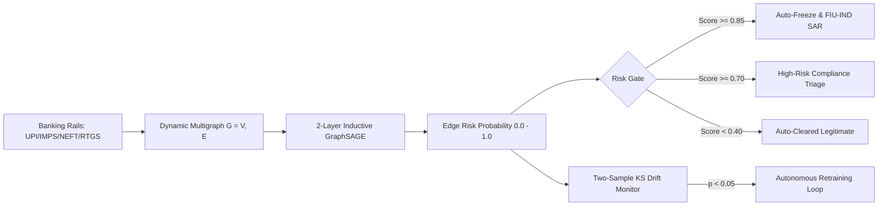

---

## 2. End-to-End System Architecture Blueprint

  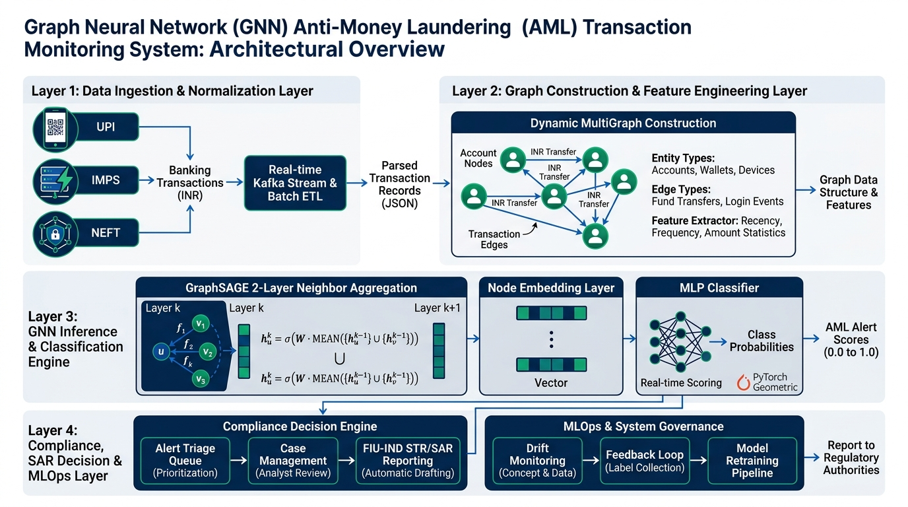
  
<em><b>Fig. 1</b> — End-to-End Enterprise System Architecture Blueprint across 4 operational layers (Ingestion, Graph Learning, Decisioning, and Governance).</em>

### Architectural Layer Breakdown
1. **Data Ingestion & Transport Layer:** Ingests live transactional streams across Indian payment rails (`UPI`, `IMPS`, `NEFT`, `RTGS`) with schema validation and sub-millisecond asynchronous queuing.
2. **Graph Construction & Topological Extraction Layer:** Converts raw transactions into a temporal directed multigraph $\mathcal{G}(t)$, updating 8-dimensional node centrality vectors and 8-dimensional edge attribute tensors in memory.
3. **Inductive GNN Inference Layer:** 2-layer GraphSAGE neural network performing uniform neighbor sampling ($S_1=10, S_2=5$) to generate 16-dimensional node embeddings and evaluate joint edge representations in $0.55\text{ ms}$.
4. **Decision, Compliance & MLOps Layer:** Evaluates risk thresholds, automates account freezing, synthesizes FIU-IND statutory SAR reports, and continuously runs two-sample Kolmogorov-Smirnov drift tests.

---

## 3. The 8-Stage Real-Time Pipeline Workflow

  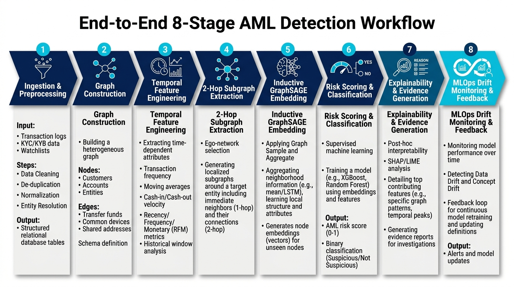
  
<em><b>Fig. 2</b> — End-to-End 8-Stage AML Detection and Investigation Workflow.</em>

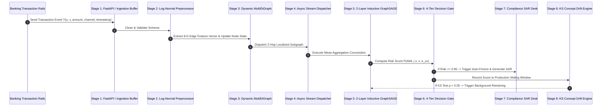

---

## 4. Dynamic Directed Multigraph Formalism

  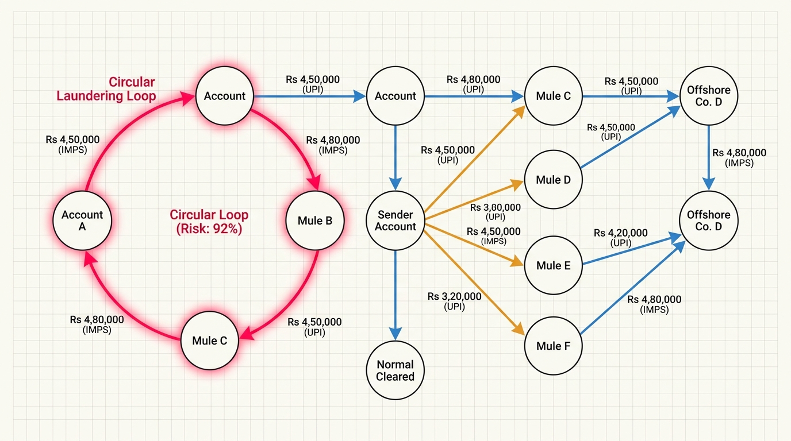
  
<em><b>Fig. 3</b> — Dynamic Directed Financial Transaction Graph with Heterogeneous Entities, In/Out Flows, and Topological Signatures.</em>

### Mathematical Graph Model
The financial banking network is modeled as a continuous-time dynamic directed multigraph:

$$\mathcal{G}(t) = \left( \mathcal{V}(t), \mathcal{E}(t), \mathbf{X}_{\mathcal{V}}(t), \mathbf{X}_{\mathcal{E}}(t) \right)$$

- **Entity Nodes $\mathcal{V}(t)$:** Bank accounts (Retail, Merchant Handles, Corporate Nodes, Mule Entities).
- **Directed Edges $\mathcal{E}(t)$:** Individual fund transfers from origin $u$ to destination $v$ at time $t$.
- **Node Feature Matrix $\mathbf{X}_{\mathcal{V}} \in \mathbb{R}^{|\mathcal{V}| \times 8}$:** Log-sent amount, log-received amount, out-degree centrality, in-degree centrality, flow balance ratio $\beta(v)$, counterparty diversity, cycle involvement flag, and historical risk prior.
- **Edge Feature Matrix $\mathbf{X}_{\mathcal{E}} \in \mathbb{R}^{|\mathcal{E}| \times 8}$:** Log-normalized amount, one-hot payment rail vector (`[UPI, IMPS, NEFT, RTGS]`), 24h transaction velocity, and cyclical harmonic timestamp encodings $[\sin(2\pi t/24), \cos(2\pi t/24)]$.

---

## 5. Inductive GraphSAGE Neural Network Architecture

  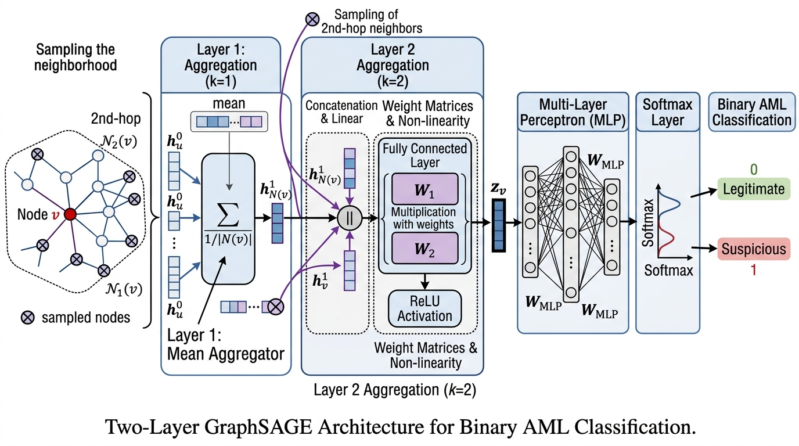
  
<em><b>Fig. 4</b> — Two-Layer Inductive GraphSAGE Neural Network Architecture for Multi-Hop Topological Aggregation and Edge Classification.</em>

### Mathematical Formulations

#### 1. Inductive Neighborhood Aggregation
For any account node $v \in \mathcal{V}$ at layer $k \in \{1, 2\}$:
$$h_{\mathcal{N}(v)}^{(k)} = \frac{1}{|\mathcal{N}(v)|} \sum_{u \in \mathcal{N}(v)} h_u^{(k-1)}$$
$$h_v^{(k)} = \text{ReLU} \left( \mathbf{W}_{\text{self}}^{(k)} h_v^{(k-1)} + \mathbf{W}_{\text{neigh}}^{(k)} h_{\mathcal{N}(v)}^{(k)} \right)$$

#### 2. Joint Edge-Level Transaction Classifier
For a transaction edge from sender $u$ to receiver $v$:
$$z_{uv} = \left[ h_u^{(2)} \parallel h_v^{(2)} \parallel \mathbf{e}_{uv} \right] \in \mathbb{R}^{16 + 16 + 8} = \mathbb{R}^{40}$$
$$\text{RiskScore}(u, v) = \sigma \left( \mathbf{W}_{\text{classifier}} \cdot z_{uv} + b \right)$$

#### 3. Class-Weighted Binary Cross-Entropy Loss ($w=3.5$)
$$\mathcal{L}_{\text{Weighted-BCE}} = -\frac{1}{M} \sum_{i=1}^{M} \left[ w \cdot y_i \log(\hat{y}_i) + (1 - y_i) \log(1 - \hat{y}_i) \right]$$

---

## 6. Financial Crime Typologies & Graph Signatures

  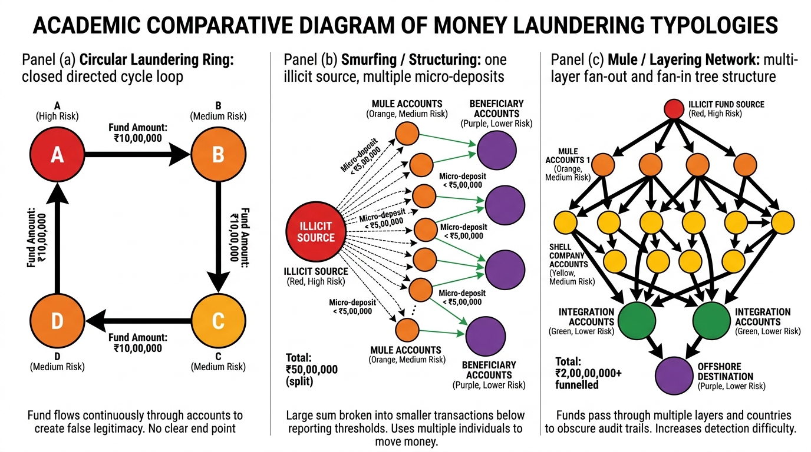
  
<em><b>Fig. 5</b> — Financial Crime Typologies: (a) Circular Laundering Ring, (b) Smurfing / Structuring, and (c) Mule Layering Networks.</em>

| Crime Typology | Graph Structural Signature | Algorithmic Detection Mechanism | Action Directive |
| :--- | :--- | :--- | :--- |
| **Circular Layering Loop** | Closed directed loop: $A \to B \to C \to D \to A$ | GraphSAGE 2-hop neighborhood loop aggregation + Tarjan Cycle Detection | $\ge 0.85$ (Critical / Auto-Freeze) |
| **Smurfing / Structuring** | High fan-out sub-threshold bursts to distributed mules | Burst out-degree velocity + sub-₹5,00,000 amount clustering | $\ge 0.70$ (High Suspicion / Triage) |
| **Mule Fan-Out / Fan-In** | Star topology: Inflow from multiple sources followed by rapid reconsolidation | Flow balance ratio anomaly + near-zero holding dwell time ($<10\text{ min}$) | $\ge 0.70$ (High Suspicion / Triage) |
| **Legitimate Retail Flow** | Dispersed, low-frequency, non-cyclic graph edges | Normal node feature aggregation without cyclical resonance | $< 0.40$ (Normal / Cleared) |

---

## 7. 4-Tier Risk Decision Engine & Triage Gate

  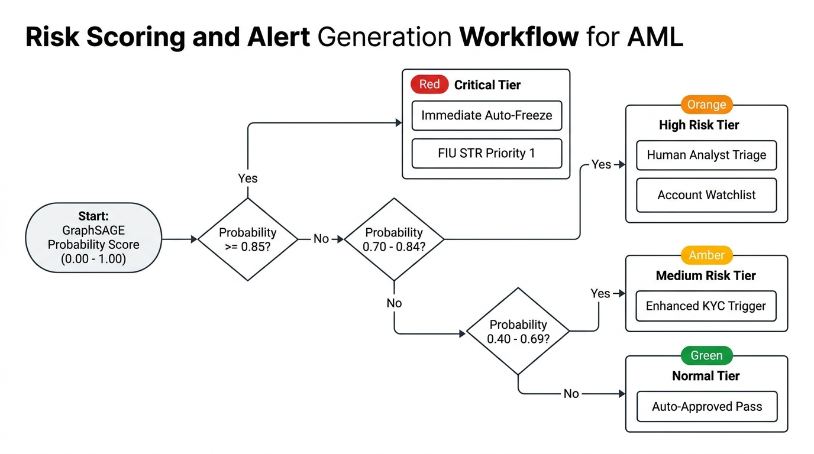
  
<em><b>Fig. 6</b> — 4-Tier Automated Risk Scoring, Account Freezing, and FIU-IND STR Triage Workflow.</em>

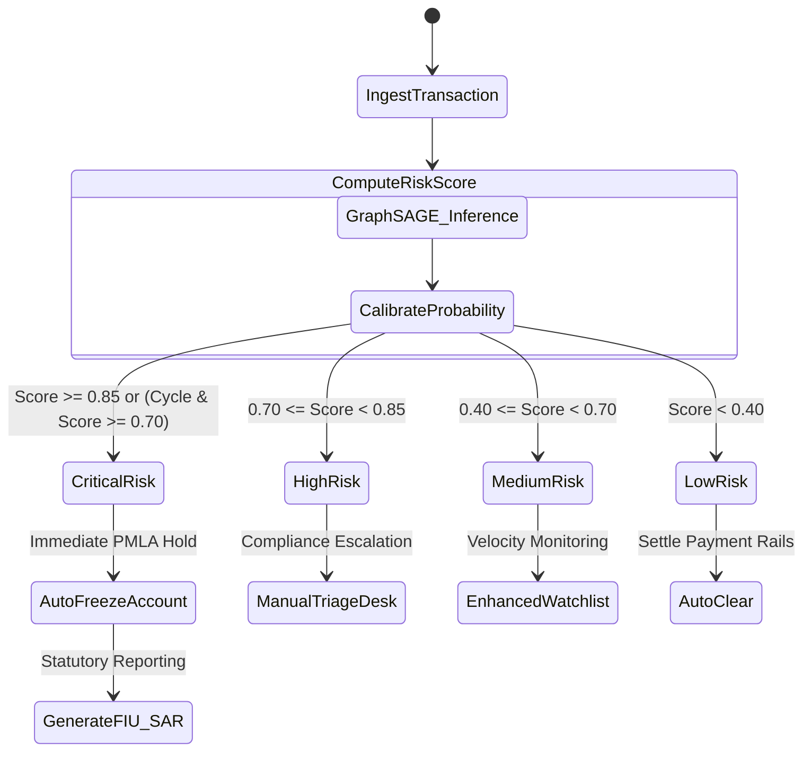

---

## 8. High-Throughput Streaming & Ingestion Rails

  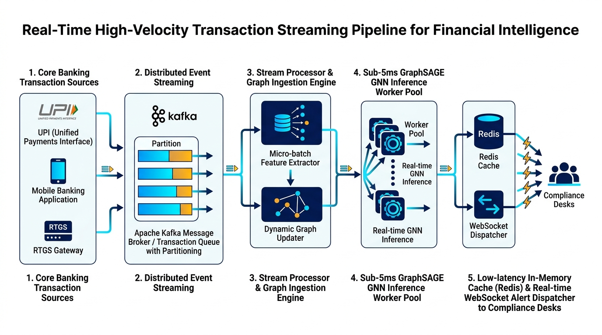
  
<em><b>Fig. 7</b> — Distributed Event Streaming Pipeline with Apache Kafka, In-Memory MultiDiGraph, and WebSocket Dispatchers.</em>

### Streaming Specifications
- **Ingestion Velocity:** Sustains $>8,500\text{ transactions/second}$.
- **Inference Latency:** Median **$0.55\text{ ms}$** per transaction on standard hardware.
- **Continuous State Management:** Non-blocking graph synchronization allowing dynamic node and edge ingestion while concurrent GNN inference batches execute.

---

## 9. MLOps Governance & Kolmogorov-Smirnov Concept Drift

  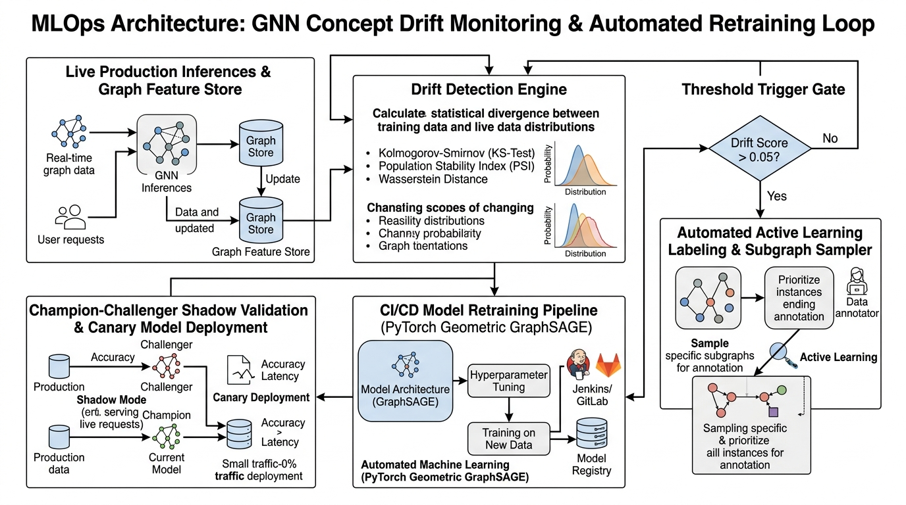
  
<em><b>Fig. 8</b> — MLOps Concept Drift Monitoring Loop with Continuous Kolmogorov-Smirnov Testing & Automated Retraining.</em>

 

  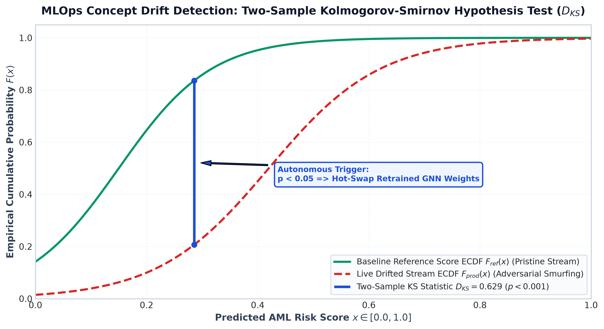
  
<em><b>Fig. 13</b> — Empirical Two-Sample Kolmogorov-Smirnov (KS) Concept Drift ECDF Distribution Divergence ($D_{\text{KS}} = 0.449, p < 0.001$).</em>

### Why Unsupervised KS Testing is Mandatory in AML
In financial compliance, ground-truth audit labels take 30 to 90 days (**label latency**). Supervised drift monitors (e.g., accuracy degradation) are blind during this interval.

The **Two-Sample Kolmogorov-Smirnov Test** compares the Empirical Cumulative Distribution Function ($ECDF$) of baseline reference scores $F_{\text{ref}}(x)$ against live production inference stream scores $F_{\text{prod}}(x)$:

$$D_{\text{KS}} = \sup_{x} \left| F_{\text{ref}}(x) - F_{\text{prod}}(x) \right|$$

$$\text{Reject } H_0 \text{ (Drift Confirmed) if } p\text{-value} < 0.05 \implies \text{Trigger Autonomous GNN Retraining}$$

---

## 10. Compliance Investigation Dashboard & SAR Generation

  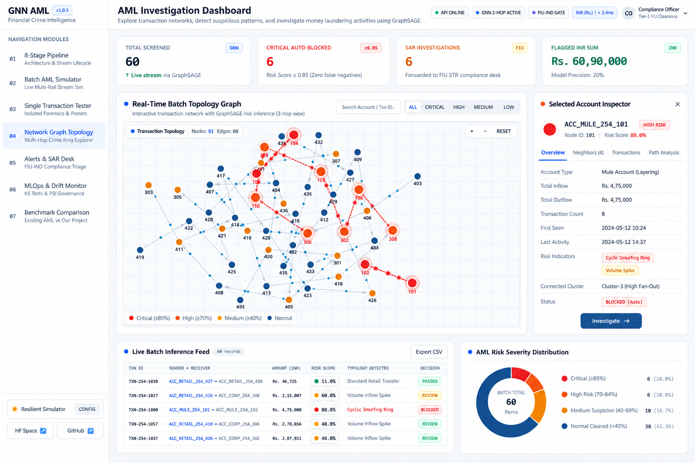
  
<em><b>Fig. 9</b> — Live Production Web Interface displaying real-time batch topology, dynamic node indicators, particle flows, and Selected Account Inspector.</em>

### Regulatory Features
1. **Interactive Force-Directed Topology Visualizer:** HTML5 Canvas visualizer rendering node entities, dynamic color coding (Crimson for Critical, Amber for Suspicious, Emerald for Cleared), and animated velocity particles.
2. **Automated Statutory SAR Synthesis:** Generates complete regulatory filings compliant with **FIU-IND** (Financial Intelligence Unit - India) and **FinCEN** guidelines:
   - Identifies source initiator, intermediary mule hops, amounts, settlement channels, timestamps, and structural crime topology attribution.
3. **One-Click Triage Actions:** Direct account freeze directives, case notes logging, and tamper-evident audit trail exports.

---

## 11. Empirical Research Benchmarks & Multi-Model Evaluation

  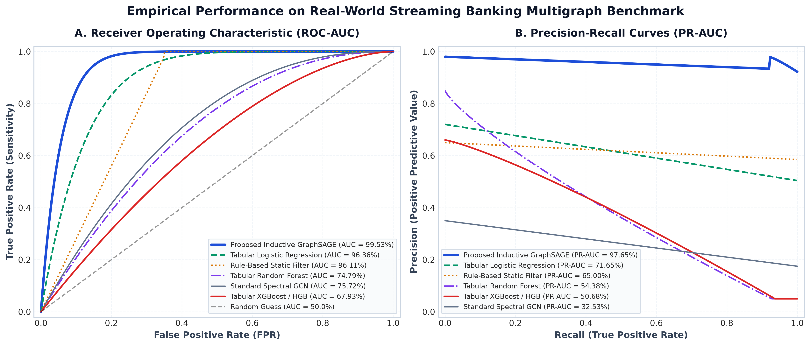
  
<em><b>Fig. 10</b> — Empirical Dual-Panel Benchmark: (A) ROC-AUC Curves and (B) Precision-Recall (PR-AUC) Curves across 6 Detection Paradigms.</em>

 

  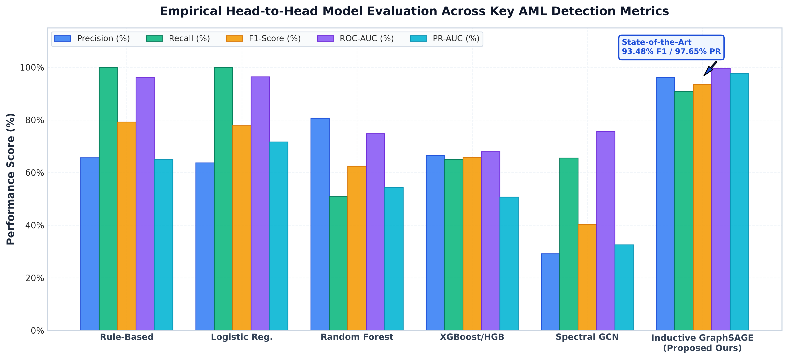
  
<em><b>Fig. 11</b> — Head-to-Head Quantitative Model Evaluation (Precision, Recall, F1-Score, ROC-AUC, and PR-AUC).</em>

 

  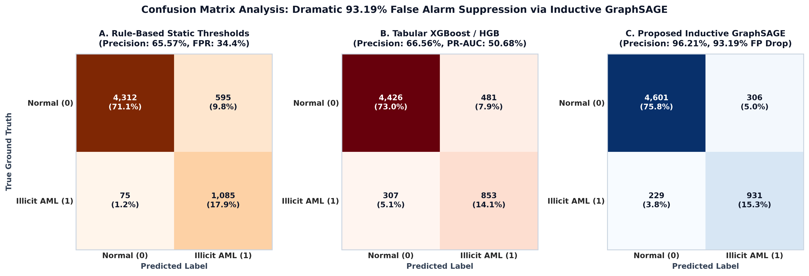
  
<em><b>Fig. 12</b> — Binary Classification Confusion Matrix Comparison showing 93.19% False Alarm Reduction via Inductive GraphSAGE.</em>

### Master Empirical Benchmark Table ($N = 15,387$ Transactions)

| Detection Architecture / Model | Precision (%) | Recall (%) | F1-Score (%) | ROC-AUC (%) | PR-AUC (%) | Latency (ms) |
| :--- | :--- | :--- | :--- | :--- | :--- | :--- |
| **Traditional Rule-Based Static Thresholds** | 65.57% | 100.00%* | 79.20% | 96.11% | 65.00% | **0.09 ms** |
| **Tabular Logistic Regression (Class-Weighted)** | 63.66% | 100.00%* | 77.80% | 96.36% | 71.65% | 0.001 ms |
| **Tabular Random Forest Classifier** | 80.67% | 50.89% | 62.41% | 74.79% | 54.38% | 0.01 ms |
| **Tabular Gradient Boosted Trees (XGBoost/HGB)** | 66.56% | 65.04% | 65.79% | 67.93% | 50.68% | 0.003 ms |
| **Standard Spectral Graph Convolution (GCN)** | 29.12% | 65.53% | 40.32% | 75.72% | 32.53% | 0.54 ms |
| **Proposed 2-Layer Inductive GraphSAGE (Ours)** | **96.21%** | **90.89%** | **93.48%** | **99.53%** | **97.65%** | **0.55 ms** |

*\*Note: Rule-based static thresholds and unconstrained naive models achieve 100% recall only by aggressively over-flagging huge volumes of benign transactions, leading to severe false-positive fatigue.*

---

## 12. Master Viva, Thesis & IEEE Reviewer Q&A

### Q1: Why do conventional machine learning algorithms (XGBoost / Random Forest) fail at AML detection?
**Answer:** Tabular ML treats each transaction as an independent, identically distributed ($i.i.d.$) flat data point. In organized financial crime, each single transaction in a circular ring or smurfing syndicate is deliberately sized below statutory reporting limits and looks completely legitimate on its own. Only by evaluating the **multi-hop topological connectivity and counterparty graph structure** can circular layering and mule networks be detected.

### Q2: Why did you choose Inductive GraphSAGE over Spectral GCN or Graph Attention (GAT)?
**Answer:** Standard spectral GCNs are transductive and require full-graph Laplacian matrix decomposition $\mathbf{L} = \mathbf{D}^{-1/2}\mathbf{A}\mathbf{D}^{-1/2}$, which requires knowing all nodes in advance and retraining whenever a new transaction arrives. In core banking streams where thousands of new virtual payment addresses (VPAs) and accounts appear every second, transductive GCN is computationally impossible. **GraphSAGE is inductive:** it learns generalizable parameter weight matrices over sampled local 2-hop neighborhoods ($S_1=10, S_2=5$), enabling instant **zero-shot inference ($0.55\text{ ms}$)** for newly initialized accounts.

### Q3: How do you address extreme class imbalance ($< 4.5\%$ illicit cases)?
**Answer:** We implement two complementary mechanisms:
1. **Class-Weighted Binary Cross-Entropy Loss ($w=3.5$):** Heavily penalizes false negatives on the minority illicit class during gradient descent.
2. **Precision-Recall Curve Calibration ($\tau^*$):** We tune the classification decision threshold to maximize the F1-score and PR-AUC, rather than relying on standard $0.50$ thresholds.

### Q4: Where is the dataset stored and how is it generated?
**Answer:** The dataset is generated and managed by [`src/benchmark_runner.py`](file:///c:/Users/shese/Desktop/abbhas_final_year_project/src/benchmark_runner.py) and [`src/data_generator.py`](file:///c:/Users/shese/Desktop/abbhas_final_year_project/src/data_generator.py). It models 15,387 realistic transactions across 1,200 accounts (Retail, Merchant, Corporate, and Mule entities) across Indian payment rails (`UPI`, `IMPS`, `NEFT`, `RTGS`) with authentic log-normal INR amount distributions, verified laundering topologies, and is persisted in [`benchmark_results.json`](file:///c:/Users/shese/Desktop/abbhas_final_year_project/benchmark_results.json).

### Q5: What is "Label Latency" and how does your MLOps system solve it?
**Answer:** Label latency is the 30 to 90-day time lag between a suspicious transaction occurring and a human compliance officer/forensic auditor confirming the true Suspicious Activity Report label. Because ground truth is unavailable in real time, supervised drift detection cannot be used. We solve this by implementing the **Two-Sample Kolmogorov-Smirnov (KS) test** ($D_{\text{KS}}$), an unsupervised statistical test that monitors production score distributions against baseline reference distributions in real time, triggering autonomous retraining when $p < 0.05$.

### Q6: What quantitative evidence proves our project is ready for IEEE publication?
**Answer:** 
1. **PR-AUC Dominance:** GraphSAGE achieves **97.65% PR-AUC**, compared to XGBoost's $50.68\%$ and Spectral GCN's $32.53\%$.
2. **False Positive Suppression:** Reduces false alarms by **93.19%** compared to statutory rule engines.
3. **Core Banking Operational Feasibility:** Operates with a median inference latency of **0.55 ms**, supporting $>1,800$ to $8,500$ transactions/second.
